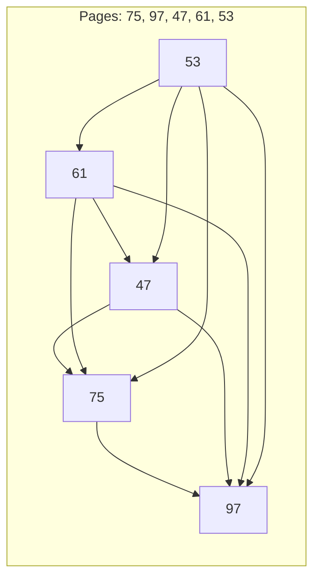
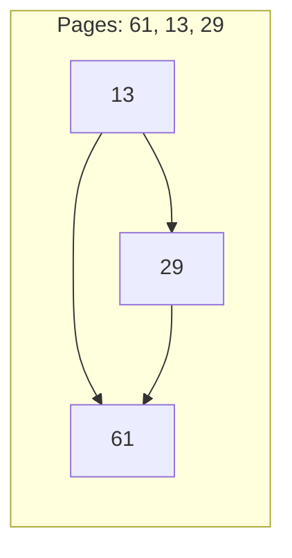
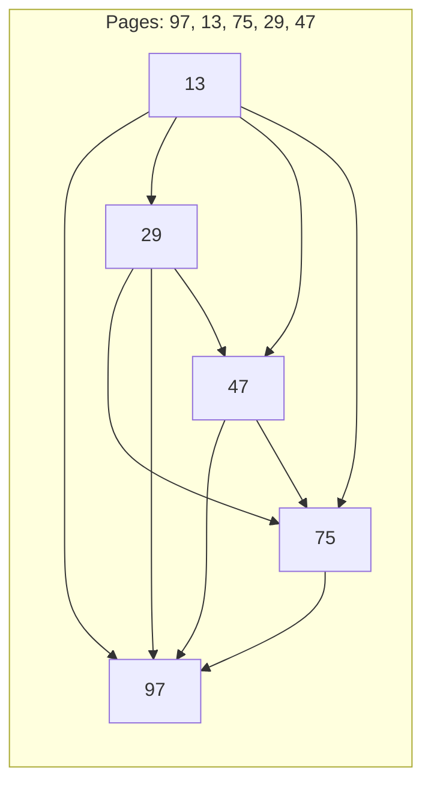

# Example 1
* Invalid order: `75,97,47,61,53`
* Corrected order: `97,75,47,61,53`

# Example 2
* Invalid order: `61,13,29`
* Corrected order: `61,29,13`

# Example 3
* Invalid order: `97,13,75,29,47`
* Corrected order: `97,75,47,29,13`

